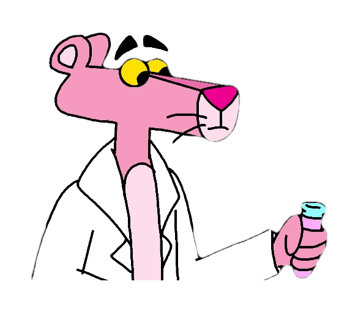

 # FeelGood

 (Built with love by @Team Phoenix at EthDenver hackathon 2018)
 
 
:small_red_triangle:  A blood donation system which provides end to end traceability through web and mobile :small_red_triangle:
 
 :hospital:

### Synopsis:
Blockchain-based blood donation system: A unique way to trace blood and add accountability to the ecosystem by:
- Enabling digital signing of donated blood bottles by an authorised donation center
- Tracing and signing a pint of blood by the testing center

(*unique feature- The testing center can digitally sign by using a basic QR code readable camera phone and verify the quality of blood received*)
- Empowering the health center (and therefore, the consumer of the blood) to track the history of blood and utilize it

### Motivation:

> Human blood is invaluable. It can not be manufactured like electronic devices and there is no substitute to it. 

Every 2 seconds, someone in the US needs blood. Even though, we **DONATE** blood, the industry in itself holds a market of a massive $ 4.5 billion USD annually in the US. [ [Forbes] ](https://www.forbes.com/sites/erincarlyle/2012/06/27/blood-money-the-guys-who-trade-your-blood-for-profit/#27d29e7282e2) 

:heavy_exclamation_mark: Unfortunately, there have been cases of innocuous and malicious blood donation, which has led to diseases like HIV AIDS and Syphilis to patients accepting blood from donors. :heavy_exclamation_mark: 


-In the early 1990s, America's industry leader in blood supply, *Red Cross closed its center in Washington DC after it was discovered that 235 people who had received blood from their donors tested positive for HIV AIDS virus.* [ [NYTimes](http://www.nytimes.com/1991/07/07/business/all-about-blood-banks-a-multibillion-dollar-business-in-a-nonprofit-world.html?pagewanted=all) ] 

-In 2008, the Center for Disease Control (CDC) uncovered 3 cases in Colorado where patients received contaminated blood which caused AIDS.
[ [CDC report](https://www.cdc.gov/mmwr/preview/mmwrhtml/mm5941a3.htm) ]

-This number is miniscule compared to such cases happening in developing countries like India. [ [Science Alert:2000 cases in India](https://www.sciencealert.com/blood-transfusions-have-given-hiv-to-more-than-2-000-people-in-india) ]

#### Most importantly, we are developing a new diverse industry by facilitating blood donation in an accountable and transparent way from developing countries in rare medical conditions such as [ [Haiti gets blood from Italy, South Africa and USA: RedCross](http://www.redcross.org/news/article/Red-Cross-Working-across-Borders-to-Ensure-Haitis-Blood-Supply) ] [ [Blood test/supply internationally between Geneva and Paris](https://www.theatlantic.com/health/archive/2014/10/the-most-precious-blood-on-earth/381911/) ] [ [Cross european blood transfer](https://www.ncbi.nlm.nih.gov/pubmed/26529138) ]

### Technologies:
```
Solidity (Ethereum platform), React-JS, uPort API, Ant.design, react-scripts, qrcode.react, uport-connect, open-zeppelin
```
### USP of our project/novelty:
:star2: :star2: :star2:
- We are providing transparency and tracebility in an inexpensive way. The Donation Center, Testing Center and Health Center need a uPort application in their smart phones to digitally sign a contract/attest quality of blood.

- Moreover, we have generated QR code labels for bottles/pints of blood which can be just read by a simple camera and taken directly to authentication page. Note: No web-app will be required if the testing and health center go with this route. This kind of a mechanism hasn't been implemented before. 

### Implemention:

1. **A donation center** authorized by the government (Like Red Cross, Denver) takes donors information and signs it using uPort (calling a smart contract) which logs the information and stores it using events.


2. **A testing center** will have laboratory assistant verifying about the quality of blood after coducting tests like -- Rho, Alpha, HIV and Syphilis. The assistant will scan the QR code attached on bottle and confirm the transaction.



3. **A health center** will be able to view all transaction history (ie. Information was verified by the donation center, and blood was tested in the lab) and then gets to filter the blood group they need for a patient. The doctor will only be able to view blood pints which are verified and unexpired. After utilising the blood resource, the doctor will sign a transaction confirming the consumption.


### How to use

#### Running with ganache locally
1. clone repo and cd into it

2. ```yarn```

3. ```yarn start```

4. ```yarn global add ganache-cli```

5. ```ganache-cli -p 9545```

6. ```cd src && truffle console --network ganache```

8. ```migrate```

9. modify address in `init_contract.js`

10. ```exec init_contract.js```


### Authors

1. Parth Gargava
2. Zhongjie He

### License

This project is licensed under the MIT License - see the LICENSE.md file for details

### Acknowledgments:

We thank EthDenver hackers and organizing committee for giving us the opportunity to build **FEELGOOD**. :heart:


